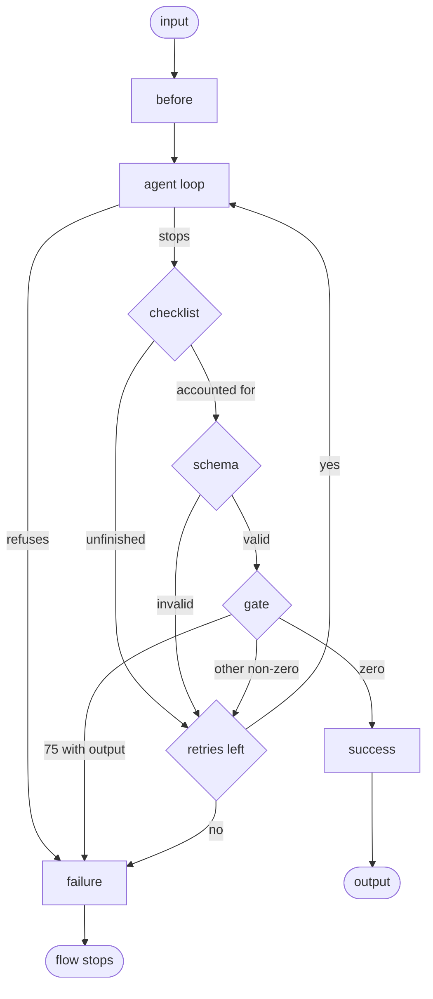

# The stage

> **Stability: stable.**

A stage is one step in a flow. A flow is a numbered folder of stages, and an
assembly is the folder that holds the flows.

A stage is a box with one input and one output. Inside are the parts this
document specifies — a `before` hook, the agent loop, three checks, and a
`success` or `failure` hook — and every one of them is optional except the agent
loop.

## Forms

A stage is a single file or a folder.

`01-name.md` is a stage defined entirely by one markdown file: frontmatter for
its configuration, body for its prompt — fenced frontmatter and body like any
sentinel, even when the frontmatter is empty
([invariant 42](invariants.md): one grammar, one parser).

`01-name/` is a stage that needs files of its own. A sentinel file inside names
the stage's type; `STAGE.md` is the sequential one, and carries the frontmatter
and body that `01-name.md` would have carried. Other sentinels name other types,
listed under [stage types](#stage-types). A schema, a gate, and hooks all live in
the folder, so a stage that needs any of them takes the folder form.

In a sequence, the leading number declares order: stages run from the lowest
number to the highest. A number is one or more digits followed by a hyphen, and
it is compared as a number, so `9-` runs before `10-` and leading zeros change
nothing. Gaps are fine. Two entries whose numbers are equal is an error. The name
after the number is the stage's identity. Some containers hold stages that do
not run in sequence — the branches of a fan-out, the alternatives of a choice —
and those are named without a number; [the control graph](graph.md) says which.

Nothing invokes a stage by name. A stage runs because the flow reached it.

## What a stage folder holds

Beside its sentinel, a stage folder may hold any of the following, and all of
them are optional.

| File                                      | Purpose                          |
| ----------------------------------------- | -------------------------------- |
| `schema.json`, `schema.md`                | [the output's contract and format](schema.md) |
| `gate`, or a `gate/` folder               | [checks the output must pass](gate.md) |
| `before`                                  | runs before the agent loop       |
| `success`                                 | runs after the output passes     |
| `failure`                                 | runs after the stage fails       |
| `skills/`                                 | skills only this stage can see   |
| `subflows/`                               | [flows only this stage can call](subflow.md) |

The runtime executes the three hooks (`before`, `success`, and `failure`) and
the gate; the operating system decides how to run them. Each needs its
executable bit set and a shebang line, or is a compiled binary, so any language
will do. A script may carry an extension naming its language — `gate.sh`,
`gate.py`, `gate.rb`, `gate.ts` — or none at all. The extension is for whoever
reads the folder; the runtime ignores it.

A folder holds one file of each kind. Two files whose name before the first dot
is `before` is an error, as is more than one schema, as is a `gate` file beside
a `gate/` folder. A schema's extension is the exception to the rule above: it is
not decorative, and it chooses the output's format.

## The prompt and the configuration

The markdown body is the prompt — the instruction the agent receives. The
frontmatter is the configuration, and it is closed: an unknown key is an error
naming the key. A stage whose body is empty is refused (`body-missing`) — a
stage with no instruction asks nothing, and an agent with no instruction is a
mistake, not a stage. A body is decoded as UTF-8, and bytes that are not
UTF-8 become replacement characters — deliberately: the body is prompt text,
the assembly can honestly run, and the author's garbage reaches the agent
visibly rather than refusing a runnable assembly.

```yaml
intelligence: default
timeout: 3600
retries: 2
workdir: ./investigator
```

Every inherited key falls back to the assembly's when a stage does not set it.
`intelligence` selects one complete bundle defined by
[the home](home.md#intelligences). `timeout` is the agent loop's budget in seconds,
3600 by default, and it covers every round of the agent's work rather than each
one separately — a held agent is still on the clock it started with, and only
the agent's own time spends it. Checks and
hooks run on clocks of their own and never spend the agent's
([invariant 22](invariants.md)). An agent that crosses it is stopped, and the
stage fails. `retries` bounds how many times a failing check may send the
agent back, and defaults to 2. A refusal or reported fault skips checks and
does not spend a retry ([control tools](runtime.md#control-tools)).

None of these reaches the agent. Which model is running, how long it has, and
how many retries remain are the runtime's business — an agent told its budget
paces itself against the budget instead of the work.

`local-context` retains its current meaning, deciding for one stage what
`$PWD`'s own context does
([invocation](invocation.md#what-pwds-own-context-does)). The stage-only
`workdir` also retains its meaning below. Neither changes the selected
intelligence bundle.

`workdir` is different from those inherited options. It belongs only to a
`STAGE`, and names that stage's working directory relative to the root workspace
selected by `bot run start --in`. It is an explicit path, not a name inferred from
the stage folder. Absolute paths, `..` paths, and `.` are refused
(`value-invalid`), and a path that is not already a directory is refused
(`path-missing`) before provider work starts. Omitting it keeps the flow's
current working directory, which is the root workspace for a top-level flow and
the calling stage's `$PWD` for a subflow.

The workspace is caller-owned. BotAssembly does not create, empty, retain, or
remove a stage's `workdir`; it only starts that stage's agent, hooks, and gates
there. Runtime-owned input, output, skills, and scratch keep their existing
lifetimes outside it ([slots](slots.md)).

These rules do not change inside containers. In a `PARALLEL`, each branch stage
resolves its own authored `workdir`; branches that author the same directory, or
omit the field, share it. Concurrent writes to a shared directory are the
author's responsibility. Every repeat of a `LOOP` stage uses the same authored
directory, so files left by an earlier repeat remain visible to later repeats;
its scratch and session identity remain repeat-specific. A subflow called from a
stage inside a container inherits that stage's resolved directory, just as a
linear subflow does.

The inherited option keys are legal in every sentinel, and a container's apply
to everything inside it ([the control graph](graph.md#what-every-container-shares)).
Each container adds its own — `repeat` on a `LOOP.md`, `width` on a
`PARALLEL.md` — and nothing else is accepted there. `workdir` is the stage-only
exception.

Frontmatter carries only what placement cannot say. A stage's position, its
order, and the folder that holds it are read from the filesystem, never restated
as keys.

## Access

The stage-only `access` key sets the boundary for tools dispatched directly for the model. `access` is a mapping with up to four operation keys: `read`, `write`, `edit`, and `bash`. Unknown operations are refused. Each operation takes an array of names with no duplicates. `access: {}` denies every operation. Empty operation arrays deny every name for those operations. An omitted `access` declaration keeps the unrestricted default described by [the runtime](runtime.md#the-agents-tools).

The file operations `read`, `write`, and `edit` name managed slot exports. The runtime slots are `INPUT`, `OUTPUT`, `TMP`, `SKILLS`, and `PWD`. A declared assembly slot contributes its uppercase export. `SUBFLOWS` is available only where subflows are in scope from the assembly root, the flow, or the stage. A valid-looking managed name that is unavailable at that stage is refused.

Bash names start with an ASCII letter or digit. The remaining characters may be ASCII letters, digits, `.`, `_`, `+`, or `-`. A name authorizes direct dispatch by that name. It does not prove that the executable is installed.

`access` belongs only to `STAGE`. A control sentinel that carries `access` is refused.

```yaml
access:
  read: [INPUT, PROJECT_DATA]
  write: [OUTPUT]
  edit: []
  bash: [git, python3]
```

## Input and output

The agent reaches everything through [slots](slots.md) — environment variables
naming what it needs, never paths it had to find.

**`$INPUT` is a directory** holding one file per source. A stage in a sequence
has one source, so its `$INPUT` holds one file, named after the stage that wrote
it: after `02-design.md`, `$INPUT/design.txt`. A stage following a fan-out has
several, each named after the branch that produced it. Nothing is ever merged;
the filenames are the namespace.

**`$OUTPUT` is one file.** The stage's output is what the agent writes there and
nothing else. The schema chooses the format, and therefore the extension. A
stage with no schema writes text — whatever the agent produced, as it stands —
and its output is named `.txt`.

A schema is a file, so a stage that wants one takes the folder form. A stage
written as a single `01-name.md` always produces `.txt`.

`$OUTPUT` does not sit under `$PWD`. The caller-owned tree may be shared — other
runs and other branches may be in it at the same time — so the one file that
has to survive the stage lives somewhere the runtime owns.

The runtime names the input files in the prompt and states what the schema
requires. How those facts are worded is [prompt construction](prompt.md).

## The agent loop

A stage's work is an agent loop: the model responds, calls a tool, reads the
result, calls another, and carries on until it stops calling tools. One stage is
one agent loop, running in one session — the log of everything the model has
said and done. The session starts fresh at every stage. What reaches a stage
from earlier stages is their outputs, never their sessions.

The loop ends when the agent stops and the stage's checks let it go. A failing
check does not start the agent over: the agent has not left, its session is
intact, and the reason it was held goes into that session as one more thing it
has read.

An agent that cannot do the job says so instead. It calls the refusal tool with
a reason, and the stage ends there: no checks run, because there is nothing to
check, and no retries are spent, because the agent is not asking for another
try. The stage fails, the reason is recorded, and the flow stops. A refusal is a
result: it says in the agent's own words what stopped the work, which is the
most useful thing a failed stage can leave behind.

## Gating

Three checks stand between the agent stopping and the stage ending, and each is
optional ([gating](gates.md)).

| Order | Check                         | Judges                   |
| ----- | ----------------------------- | ------------------------ |
| 1     | [the checklist](checklist.md) | what the agent did       |
| 2     | [the schema](schema.md)       | the shape of the output  |
| 3     | [the gate](gate.md)           | whether the work is good |

An agent that stopped without writing `$OUTPUT` is caught before any of them.

The first ordinary failure ends the round and sends the agent back into its own
session with the reason. `retries` bounds how many send-backs a stage allows,
whichever check caused them: at the default of 2, three rounds at most, and the
stage fails when the last one does. A gate exiting `75` with nonempty captured
output is an external blocker instead: it ends the stage immediately with exit
`1`, cause `blocked`, and its output as the reason, without a send-back or
retry.

## Hooks

Three hooks bracket the agent loop ([hooks](hooks.md)). Each runs with the same
slots in its environment as the agent, and changes things by writing files.

| Hook      | Runs                                | May change |
| --------- | ----------------------------------- | ---------- |
| `before`  | before the agent loop               | `$INPUT`   |
| `success` | after the output passes every check | nothing    |
| `failure` | after the stage fails               | nothing    |

So `before` rewrites what the agent sees; `success` reads and publishes what
passed — the output is no longer anyone's to change ([hooks](hooks.md)).

A hook's own exit code counts. `before` exiting non-zero fails the stage before
the agent has run at all, and the record names `before` as what failed.
`success` exiting non-zero fails a stage whose output had already passed its
checks. `failure` runs whenever a stage fails, including that first case, where
there is no output for it to look at; it runs after the fact. Its exit, timeout,
inability to execute, output overflow, or hash-recheck drift is diagnostic
evidence only and cannot replace the stage's existing ending.

A hook runs once per stage. A held-back agent is still inside the same stage, so
being sent back by a check does not re-run `before`.

## Inside a stage



1. `before` runs. What it writes is the agent loop's input.
2. The agent works until it stops, or until it refuses.
3. The checklist, the schema, and the gate run in that order. The first
   ordinary failure ends the round; a gate exit `75` with nonempty output is an
   external blocker and fails the stage immediately.
4. An ordinary failure puts its reason into the agent's session and sends the
   agent back to 2, without re-running `before`. When the retries run out, the
   stage fails.
5. A refusal skips 3 and 4 entirely and fails the stage.
6. `success` or `failure` runs, according to the outcome.

Any step the stage did not declare is skipped.

## Exit

A stage exits with one of these codes.

| Code    | Meaning                                                      |
| ------- | ------------------------------------------------------------ |
| `0`     | success                                                      |
| `1`     | failure — a check said no, the agent refused or ran out its clock, a `before`/`success` hook ran cleanly and exited non-zero, or a gate reported an external blocker: the stage working as designed, the work rejected or blocked |
| `2`     | the run was found impossible while the stage ran — a gate or `before`/`success` hook that could not execute, hung, or broke a passed output, or the machinery beneath the run failing; failure-hook breakage is recorded diagnostic evidence and keeps the prior failed ending |
| `128+n` | killed by signal `n`: 130 is Ctrl-C, 143 is terminated        |

A stage malformed on disk never reaches this table. The whole assembly is read
and checked before anything runs, so a stage that would not have parsed simply
never runs, and the run itself exits `2`. The `2` above is the same fault found
late — the folder was well formed and one of its executables was not
([the runtime](runtime.md#exit-codes)).

A stage that exits non-zero stops the flow: later stages do not run, and the
flow exits with that same code.

## Stage types

A stage folder holds exactly one sentinel file, and the sentinel names the
stage's type. Zero sentinels, or two, is an error. All sentinel files are
capitalized.

| Sentinel      | Type                                            |
| ------------- | ----------------------------------------------- |
| `STAGE.md`    | runs once, in its numbered position             |
| `LOOP.md`     | repeats its contents                            |
| `CHOOSE.md`   | selects one of several alternatives and runs it |
| `PARALLEL.md` | runs several branches at once                   |

**Stage** in this document means the first row, in either form: a folder typed
by `STAGE.md`, or a single `01-name.md`. Those run an agent and produce an
output, and everything above this section is about them.

The rest are **containers**. A container arranges stages and passes along what
they produced. It has no hooks and no checks, because it produces no output of
its own to check ([the control graph](graph.md#what-every-container-shares)).

What each container decides, and how, is [the control graph](graph.md).
